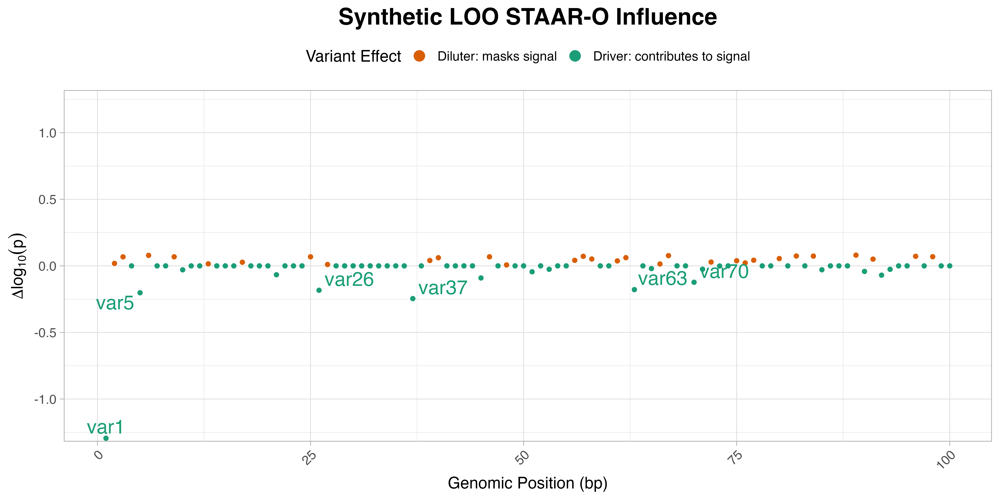

<p align="center">
  
</p>

[](https://www.gnu.org/licenses/gpl-3.0)

# looSTAAR

An R package for performing leave-one-out analysis for STAAR models. This package provides functions like `looSTAAR` and `plot_looSTAAR` and includes a vignette (`looSTAAR-guide`) for usage instructions.

## Installation
```R
if (!requireNamespace("devtools", quietly = TRUE)) install.packages("devtools")
library(devtools)
install_github("adams-charleen/looSTAAR", build_vignettes = TRUE)
library(looSTAAR)
vignette("looSTAAR-guide")
```

## Example Results

| Variant_ID | Baseline_STAAR_O_pval | LOO_STAAR_O_pval | Delta_log10p | Position |
|------------|------------------------|------------------|---------------|----------|
| var1       | 0.005431518            | 0.107018465      | -1.29453753   | 1        |
| var2       | 0.005431518            | 0.005202969      |  0.01866999   | 2        |
| var3       | 0.005431518            | 0.004647219      |  0.06772807   | 3        |
| var4       | 0.005431518            | 0.005431518      |  0.00000000   | 4        |
| var5       | 0.005431518            | 0.008647024      | -0.20194549   | 5        |
| var6       | 0.005431518            | 0.004527936      |  0.07902095   | 6        |


## Interpretation

- The `Baseline_STAAR_O_pval` refers to the omnibus (gene- or region-level) association (not the effects of individual SNPs; it's the same for all). 

- `LOO_STAAR_O_pval` is the omnibus p-value from `STAAR` with the given SNP removed. 

- `Delta_log10p` is the log10 p-value of the difference between `Baseline_STAAR_O_pval` and `LOO_STAAR_O_pval`, where:

<b>Δ</b> = log<sub>10</sub>(<i>p</i><sub>full</sub>) − log<sub>10</sub>(<i>p</i><sub>LOO<sub>i</sub></sub>) = log<sub>10</sub>(<i>p</i><sub>full</sub> / <i>p</i><sub>LOO<sub>i</sub></sub>)

A large `Delta_log10p` (positive or negative) indicates that a variant influences the omnibus association — though the direction of the effect matters.

- A **negative** `Delta_log10p` (e.g., −1.29) means *p*<sub>LOO<sub>i</sub></sub> > *p*<sub>full</sub>, so removing the variant makes the association **less significant**, indicating it **contributes to the signal** (a *driver*).
- A **positive** `Delta_log10p` means *p*<sub>LOO<sub>i</sub></sub> < *p*<sub>full</sub>, so removing the variant makes the association **more significant**, suggesting it **masks the signal** (a *diluter*).

<p align="center">
  
</p>


## Conclusion

`looSTAAR` is a tool to probe rare-variant contributions from `STAAR` omnibus test results using leave-one-out (LOO) analysis. The `Delta_log10p` values provide a quantitative measure of each variant’s influence on the gene- or region-level association, enabling researchers to identify key drivers that strengthen the signal (negative values) or diluters that mask it (positive values). This insight is particularly useful for prioritizing variants for functional validation or further investigation in genomic studies. The accompanying visualization of `Delta_log10p` against genomic position enhances interpretability, highlighting patterns of influence across a region.


## Credit

I gratefully acknowledge the foundational work of Li and colleagues (2020, 2022) in developing the STAAR framework, which `looSTAAR` builds upon. Please cite their papers if you use `looSTAAR` in your research:

- Li, X., Li, Z., Zhou, H., Gaynor, S. M., Liu, Y., Chen, H., ... & Lin, X. (2020). *Dynamic incorporation of multiple in silico functional annotations empowers rare variant association analysis of large whole-genome sequencing studies at scale*. *Nature Genetics*, 52(9), 969-983. [PMID: 32839606](https://pubmed.ncbi.nlm.nih.gov/32839606/), [PMCID: PMC7483769](https://www.ncbi.nlm.nih.gov/pmc/articles/PMC7483769/), [DOI: 10.1038/s41588-020-0676-4](https://doi.org/10.1038/s41588-020-0676-4).

- Li, Z., Li, X., Zhou, H., Gaynor, S. M., Selvaraj, M. S., Arapoglou, T., ... & Lin, X. (2022). *A framework for detecting noncoding rare variant associations of large-scale whole-genome sequencing studies*. *Nature Methods*, 19(12), 1599-1611. [PMID: 36303018](https://pubmed.ncbi.nlm.nih.gov/36303018/), [PMCID: PMC10008172](https://www.ncbi.nlm.nih.gov/pmc/articles/PMC10008172/), [DOI: 10.1038/s41592-022-01640-x](https://doi.org/10.1038/s41592-022-01640-x).

